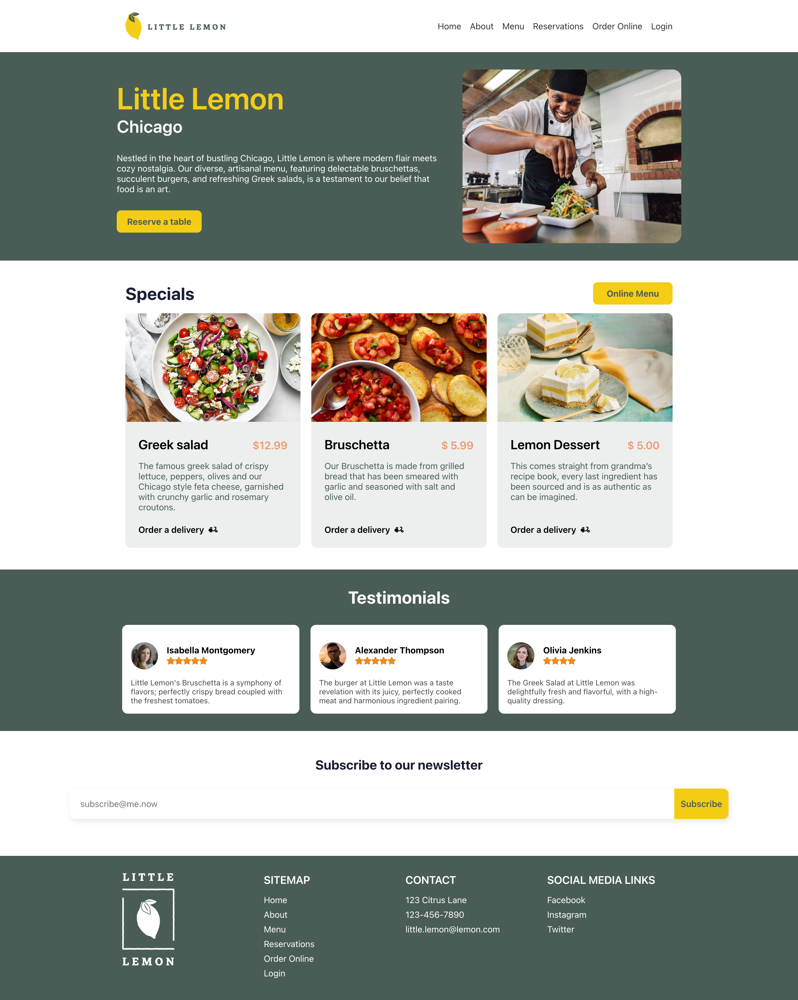
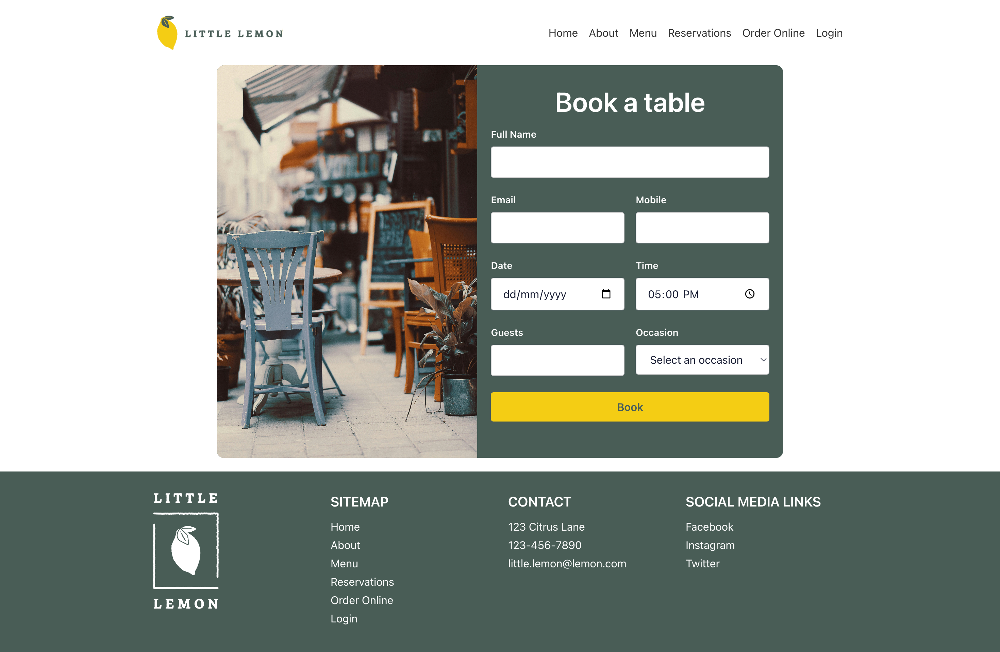
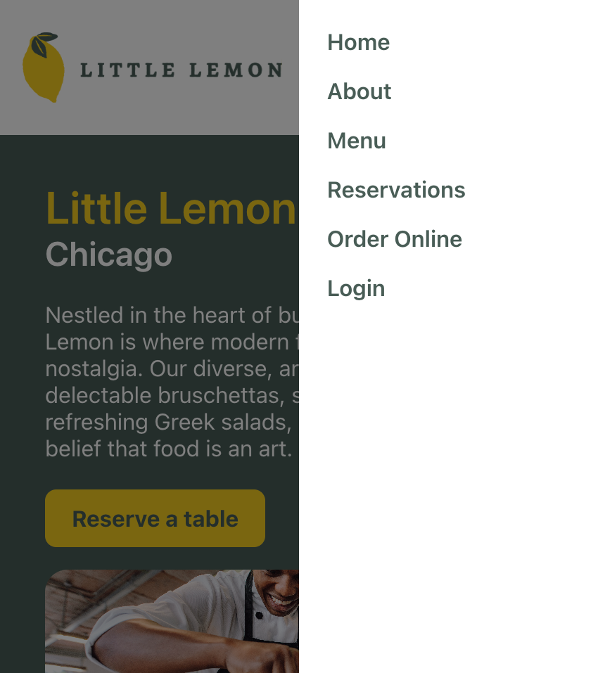
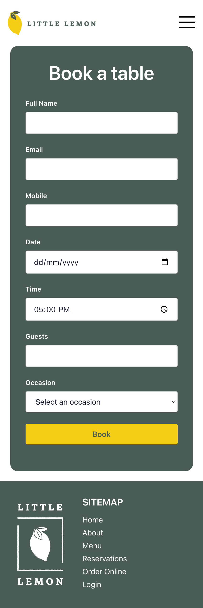
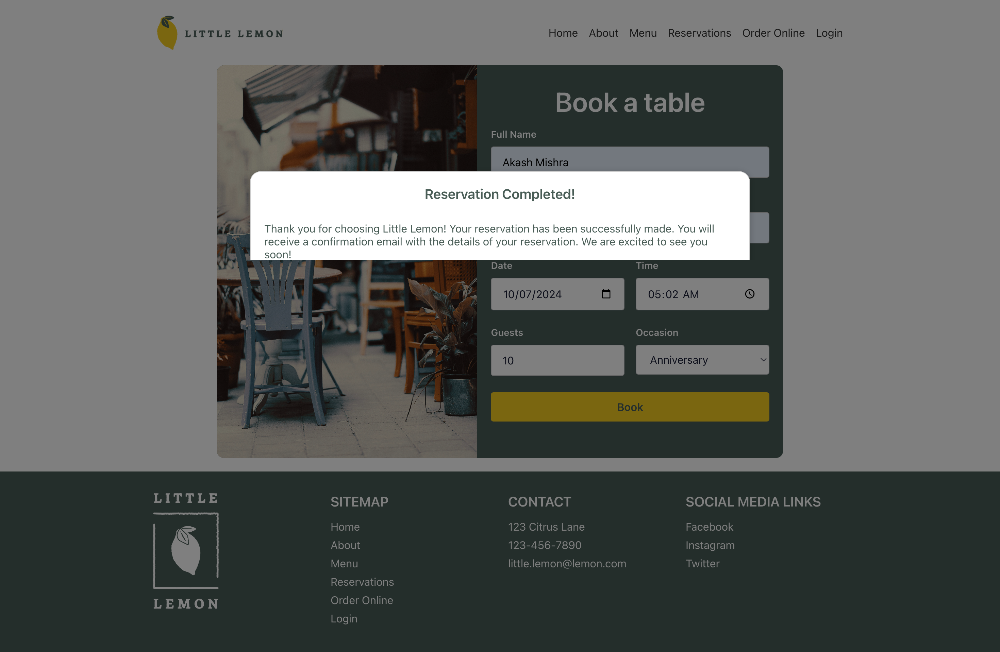

# Project Screenshots
<figure>
  <figcaption>Full page screenshot</figcaption>
  
   
</figure>

<figure>
  <figcaption>Reservation screenshot</figcaption>
  
   
</figure>

<figure>
  <figcaption>Side Menu screenshot</figcaption>
  
   
</figure>

<figure>
  <figcaption>Responsive Full screenshot</figcaption>
  
   
</figure>
<figure>
  <figcaption>Reservation Responsive screenshot</figcaption>
  
   
</figure>
<figure>
  <figcaption>Confirmation screenshot</figcaption>
  
   
</figure>
